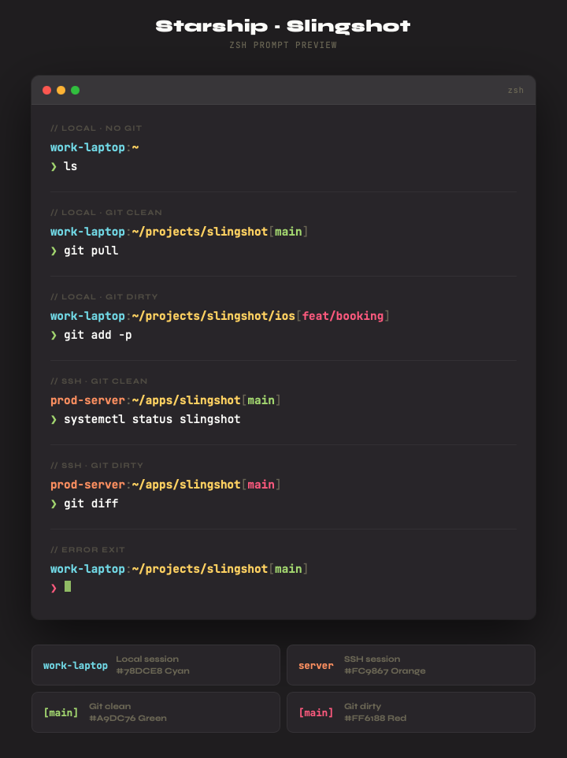

# shell-config

Portable shell configuration for macOS (zsh) and Linux (bash/zsh). Uses [Starship](https://starship.rs/) for a consistent prompt across shells and machines.

## Slingshot Theme



## Install

```sh
curl -sS https://raw.githubusercontent.com/cain004/shell-config/main/install.sh | sh
```

Re-run anytime to pull the latest changes.

## What it does

The install script will:

1. Install **zsh** and **git** via apt if missing (Linux only)
2. Install **Starship** prompt
3. Clone this repo to `~/.shell-config`
4. Back up existing dotfiles (`.zshrc`, `.bashrc`, `.aliases`, `.tmux.conf`, `starship.toml`) to `.bak`
5. Symlink dotfiles from the repo into `~/` and `~/.config/`
6. Set zsh as the default shell (Linux only, if not already zsh)

## Files

| File | Purpose |
|---|---|
| `.aliases` | Git and shell aliases — shared by bash and zsh |
| `.zshrc` | Zsh config (macOS) — completion, history, PATH, Starship |
| `.bashrc` | Bash config (Linux) — completion, history, colors, Starship |
| `.tmux.conf` | Tmux configuration |
| `starship.toml` | Starship prompt — Slingshot theme with git status and SSH detection |
| `install.sh` | One-line installer |

## Git aliases

| Alias | Command |
|---|---|
| `ga` | `git add` |
| `gbl` | `git blame -b -w` |
| `gc` | `git commit -v` |
| `gcmsg` | `git commit -m` |
| `gco` | `git checkout` |
| `gcp` | `git cherry-pick` |
| `gclean` | `git clean -id` |
| `gpristine` | `git reset --hard && git clean -dffx` |
| `gd` | `git diff` |
| `gl` | `git pull` |
| `glg` | `git log --stat` |
| `glgg` | `git log --graph` |
| `glog` | `git log --oneline --decorate --graph` |
| `gp` | `git push` |
| `gpsup` | `git push --set-upstream origin <current-branch>` |
| `gst` | `git status` |
| `gsta` | `git stash push` |
| `gstp` | `git stash pop` |
| `gstl` | `git stash list` |
| `gstc` | `git stash clear` |
| `gstall` | `git stash --all` |

## Other aliases

| Alias | Command |
|---|---|
| `ll` | `ls -AlFh` |
| `la` | `ls -A` |
| `lt` | `tree -C -L 2` |

## Updating

Since the dotfiles are symlinked, pulling the repo updates everything:

```sh
cd ~/.shell-config && git pull
```

Or just re-run the install command.
